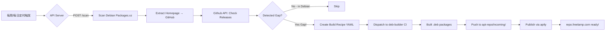

# Debian Auto Builder 系统架构

## 🎯 核心目标

实现 **全自动化的 APT 包构建漏斗**：
1. 自动扫描 Debian 官方源 (`packages.debian.org`)
2. 检查每个包的 `Homepage` 字段指向 GitHub
3. 查询该项目的 Releases，看是否有对应架构的 `.deb`
4. 如果没有 → **自动生成 build recipe + 触发 CI 构建**

## 📊 系统组件

### 1. debian-auto-builder (API Server)
**负责**: 自动扫描缺口检测
- `GET /health` —— 健康检查
- `POST /scan` —— 批量扫描 tracked packages
- `POST /auto-scan` —— 全自动化扫描 + 触发构建

### 2. deb-builder (CI/CD Pipeline)
**负责**: 接收构建任务并生成 .deb
- **Scanner**: `cmd/scan` - 解析 Debian Packages.xz，找 GitHub 项目
- **Checker**: `cmd/check` - 检测架构缺口（Debian missing / GitHub missing）
- **Builder**: Go cross-compiler + build scripts

### 3. gh-dbuild (GitHub Actions Trigger)
**负责**: dispatch workflow 到 deb-builder
- Cron job 每天运行 scan
- Dispatch to: `LeisureLinux/deb-builder`
- Creates: `recipes/*.yaml` build configs

## 🔄 工作流程图



## 🛠️ 部署步骤

### Step 1: API Server (debian-auto-builder)

```bash
cd debian-auto-builder
./start.sh  # Run on your VPS or container

# Or deploy to Kubernetes/Docker:
docker build -t debian-scan .
docker run -p 8080:8080 debian-scan
```

### Step 2: GitHub Repos Setup

- ✅ `LeisureLinux/debian-auto-builder` —— API Server + Scheduler
- ✅ `LeisureLinux/deb-builder` —— CI Pipeline (Build recipes → .deb)
- ✅ `LeisureLinux/apt-repo` —— APT Repository Hosting (GitHub Pages)

### Step 3: Enable Workflow Permissions

```bash
# In apt-repo settings:
# - Go to Actions → Settings
# - Enable: "Allow GitHub Actions to create and approve pull requests"
```

## 📁 file structure

```
mygithub/
├── debian-auto-builder/          ← API Server + Scanner
│   ├── main.go                   # Flask/FastAPI server
│   ├── tracked.json              # Packages we're tracking (dundee/gdu)
│   └── .github/workflows/cron-scan.yml  ← Weekly scan trigger

├── deb-builder/                   ← Build pipeline
│   ├── cmd/scan/                 # Debian packages scanner
│   ├── recipes/*.yaml            # Go build configs
│   └── .github/workflows/
│       ├── receive-trigger.yml   ← Listen to dispatch events
│       └── build.yml             # Actual CI: scan → check → build

└── apt-repo/                      ← APT repository
    ├── CNAME                     # repo.freelamp.com
    └── .github/workflows/publish.yml  ← GH Pages deployment
```

## 🔑 Key Secrets Needed (GitHub)

| Secret | Purpose | Scope |
|--------|---------|-------|
| `BUILDER_PAT` | Push to apt-repo via API | debian-auto-builder workflow |
| `GITHUB_TOKEN` | Dispatch workflows between repos | All workflows |
| `APT_GPG_PRIVATE_KEY` | Sign .deb packages for apt-repo | apt-repo publish workflow |

## 🚀 Next Actions

- [x] Create debian-auto-builder skeleton + API server
- [ ] Run tests on tracked.json sample data  
- [ ] Deploy to production (your VPS)
- [ ] Test end-to-end: Scan → Build → Publish → Install from apt-repo
